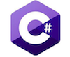

<a href="https://softuni.bg" rel="Courses">  ![SoftUni logo][logo] <a/>

[logo]: http://innovationstarterbox.bg/wp-content/uploads/2016/05/Softuni_logo_trasparent.png "SoftUni Logo"

---

## <b>Software Technologies - March 2018 homework</b>

---

## <b>Tasks</b>
- [GitHub](https://github.com/peyopeev0206/SoftUni/tree/master/Software%20Technologies/GitHub)
- [GitHubGitHubGitHubGitHubGitHubGitHub](https://github.com/peyopeev0206/SoftUni/tree/master/Software%20Technologies/GitHub)

